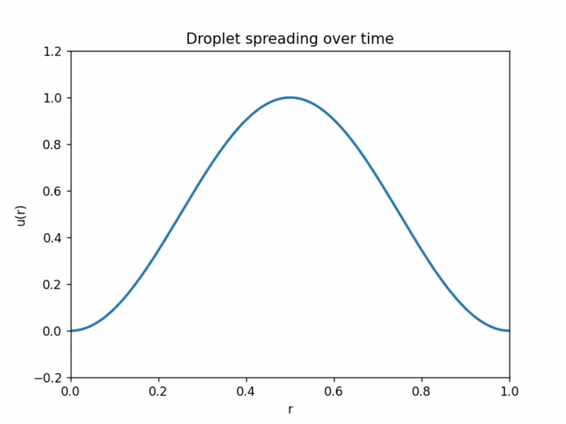
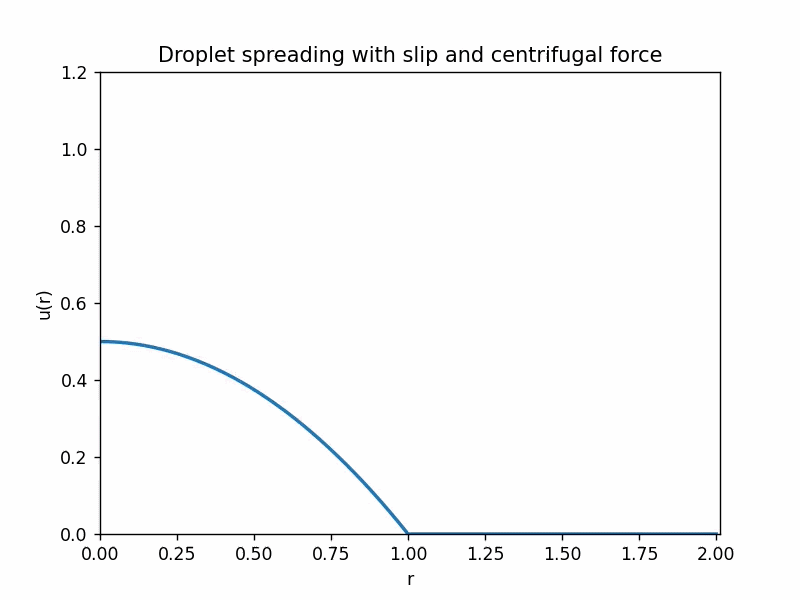

# Droplet Spreading on a Rotating Disk

This project studies the spreading of a viscous droplet on a rotating disk using a thin-film lubrication model derived from the Navier–Stokes equations. The goal is to simulate the time evolution of the droplet height profile and analyze the stability and physical consistency of the numerical scheme.

Thin-film equations of this type appear in lubrication theory, coating flows, and droplet spreading problems.

---

# Physics Model

The governing equation is the axisymmetric thin-film equation

∂u/∂t + (1/r) ∂/∂r ( r M(u) ∂P/∂r ) = 0

where

P = ((r u_r)_r) / r  
M(u) = u² (u + 3λ)

This model captures important physical effects such as

• capillary driven spreading  
• slip boundary conditions  
• centrifugal forces due to disk rotation  

---

# Numerical Method

The equation is solved using

• Finite Element Method (FEM)  
• Weak variational formulation  
• Implicit time integration  
• Non-negativity preserving mobility scheme  

The numerical scheme follows the entropy-stable framework proposed by **Grün & Rumpf**, ensuring

• numerical stability  
• physically consistent solutions  
• preservation of non-negative film thickness  

---

# Simulation Results

## Droplet spreading simulation



Full resolution video:  
[droplet_spreading.mp4](droplet_spreading.mp4)

This animation shows the evolution of the droplet height profile as the fluid spreads radially across the disk.

---

## Droplet spreading with slip and centrifugal force



Full resolution video:  
[droplet_spreading_with_slip.mp4](droplet_spreading_with_slip.mp4)

This simulation includes additional physical effects such as slip boundary conditions and centrifugal forces, which modify the spreading behavior of the droplet.

---

# Repository Contents

```
thinfilm_simulation.py
droplet_spreading.gif
droplet_spreading.mp4
droplet_spreading_with_slip.gif
droplet_spreading_with_slip.mp4
Final_Report.pdf
README.md
```

---

# Author

Atharva Sinnarkar  
M.Sc Computational Engineering  
FAU Erlangen–Nürnberg  

GitHub: https://github.com/Atharva224

---

# License

MIT License
